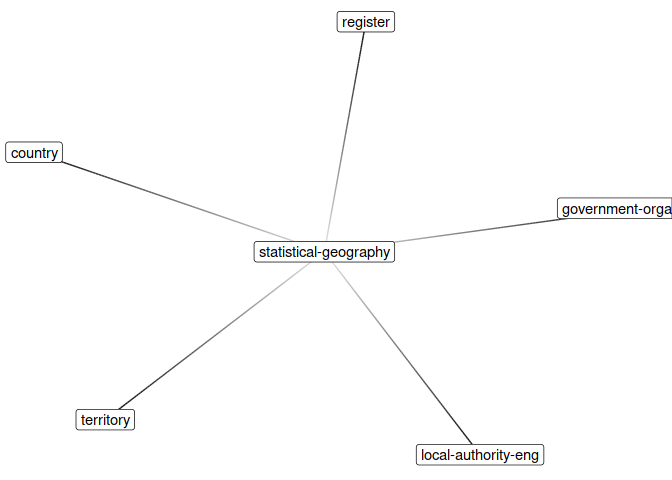

<!-- README.md is generated from README.Rmd. Please edit that file -->

# registr

This is an unofficial client for the [GOV.UK](https://www.gov.uk/)
[Registers](https://registers.cloudapps.digital/)
[API](https://registers-docs.cloudapps.digital/#api-documentation-for-registers).

Registers are authoritative lists of things, built and maintained by the
UK government, for example, the `country` register is a list of
countries.

It doesn’t really wrap the API. Instead, it downloads the ‘raw’
registers in RSF (Register Serialisation Format – not yet documented
publicly), and parses
that.

## Installation

``` r
# install.packages("devtools") # if you don't already have devtools installed
devtools::install_github("nacnudus/registr")
```

To install a very early version of the package for running old scripts:

``` r
devtools::install_github("nacnudus/registr",
                         ref = "08c42c95bc65a0cb8131100416a372660b8a1bd5")
```

## Examples

``` r
library(registr)
```

### Download registers

Download a single register.

``` r
country <- rr_register("country")
```

Download all registers.

``` r
registers <- rr_registers(quiet = TRUE)
names(registers)
#>  [1] "country"                                            
#>  [2] "field"                                              
#>  [3] "territory"                                          
#>  [4] "government-organisation"                            
#>  [5] "government-service"                                 
#>  [6] "local-authority-sct"                                
#>  [7] "principal-local-authority"                          
#>  [8] "register"                                           
#>  [9] "datatype"                                           
#> [10] "internal-drainage-board"                            
#> [11] "registration-district"                              
#> [12] "statistical-geography-unitary-authority-wls"        
#> [13] "statistical-geography"                              
#> [14] "prison-estate"                                      
#> [15] "local-authority-nir"                                
#> [16] "statistical-geography-county-eng"                   
#> [17] "statistical-geography-london-borough-eng"           
#> [18] "statistical-geography-metropolitan-district-eng"    
#> [19] "statistical-geography-registration-district-eng"    
#> [20] "statistical-geography-registration-district-wls"    
#> [21] "statistical-geography-non-metropolitan-district-eng"
#> [22] "statistical-geography-unitary-authority-eng"        
#> [23] "allergen"                                           
#> [24] "statistical-geography-local-government-district-nir"
#> [25] "jobcentre"                                          
#> [26] "jobcentre-district"                                 
#> [27] "jobcentre-group"                                    
#> [28] "local-authority-type"                               
#> [29] "local-authority-eng"                                
#> [30] "qualification-assessment-method"                    
#> [31] "qualification-level"                                
#> [32] "qualification-sector-subject-area"                  
#> [33] "qualification-type"                                 
#> [34] "government-domain"
```

By default, the ‘beta’ (‘ready to use’) versions of registers are
downloaded. If you need alpha (‘open for feedback’) registers, use
`phase = "alpha")`

### Explore register schema and data

The schema and data are in `$shema` and `$data`.

``` r
country <- registers$country
country$schema
#> $ids
#> # A tibble: 1 x 6
#>   `entry-number` type   key   timestamp           hash               name 
#>            <int> <chr>  <chr> <dttm>              <chr>              <chr>
#> 1              1 system name  2017-07-17 10:59:47 d3d8e15fbd410e08b… coun…
#> 
#> $names
#> # A tibble: 0 x 5
#> # ... with 5 variables: `entry-number` <int>, type <chr>, key <chr>,
#> #   timestamp <dttm>, hash <chr>
#> 
#> $custodians
#> # A tibble: 2 x 6
#>   `entry-number` type   key       timestamp           hash       custodian
#>            <int> <chr>  <chr>     <dttm>              <chr>      <chr>    
#> 1              2 system custodian 2017-07-17 10:59:47 6bdb76b1c… Tony Wor…
#> 2             12 system custodian 2017-11-02 11:18:00 aa98858fc… David de…
#> 
#> $fields
#> # A tibble: 8 x 11
#>   `entry-number` type   key    timestamp           hash     field datatype
#>            <int> <chr>  <chr>  <dttm>              <chr>    <chr> <chr>   
#> 1              3 system field… 2017-01-10 17:16:07 a303d05… coun… string  
#> 2              4 system field… 2017-01-10 17:16:07 a7a9f22… name  string  
#> 3              5 system field… 2017-01-10 17:16:07 5c4728f… offi… string  
#> 4              6 system field… 2017-01-10 17:16:07 494f6fa… citi… string  
#> 5              7 system field… 2017-01-10 17:16:07 1cff4c6… star… datetime
#> 6              8 system field… 2017-01-10 17:16:07 a557fa9… end-… datetime
#> 7             10 system field… 2017-08-29 11:30:00 f09c439… star… datetime
#> 8             11 system field… 2017-08-29 11:31:00 c5845bf… end-… datetime
#> # ... with 4 more variables: phase <chr>, register <chr>,
#> #   cardinality <chr>, text <chr>
country$data
#> # A tibble: 207 x 11
#>    `entry-number` type  key   timestamp           hash       country name 
#>             <int> <chr> <chr> <dttm>              <chr>      <chr>   <chr>
#>  1             13 user  SU    2016-04-05 13:23:05 e94c4a9ab… SU      USSR 
#>  2             14 user  DE    2016-04-05 13:23:05 e03f97c28… DE      West…
#>  3             15 user  DD    2016-04-05 13:23:05 e1357671d… DD      East…
#>  4             16 user  YU    2016-04-05 13:23:05 a074752a7… YU      Yugo…
#>  5             17 user  CS    2016-04-05 13:23:05 0031f311f… CS      Czec…
#>  6             18 user  GB    2016-04-05 13:23:05 6b1869387… GB      Unit…
#>  7             19 user  AF    2016-04-05 13:23:05 6bf7f01f2… AF      Afgh…
#>  8             20 user  AL    2016-04-05 13:23:05 9d04a7e04… AL      Alba…
#>  9             21 user  DZ    2016-04-05 13:23:05 3548cdf52… DZ      Alge…
#> 10             22 user  AD    2016-04-05 13:23:05 14fcb5099… AD      Ando…
#> # ... with 197 more rows, and 4 more variables: `official-name` <chr>,
#> #   `citizen-names` <chr>, `start-date` <chr>, `end-date` <chr>
```

You probably want to take a snapshot first. This will take the latest
version of the schema, and the latest version of each record (e.g. the
most recent name of a country)

``` r
country$schema$custodian
#> # A tibble: 2 x 6
#>   `entry-number` type   key       timestamp           hash       custodian
#>            <int> <chr>  <chr>     <dttm>              <chr>      <chr>    
#> 1              2 system custodian 2017-07-17 10:59:47 6bdb76b1c… Tony Wor…
#> 2             12 system custodian 2017-11-02 11:18:00 aa98858fc… David de…
rr_snapshot(country)$schema$custodian
#> # A tibble: 1 x 6
#>   `entry-number` type   key       timestamp           hash       custodian
#>            <int> <chr>  <chr>     <dttm>              <chr>      <chr>    
#> 1             12 system custodian 2017-11-02 11:18:00 aa98858fc… David de…
```

Each field of each entry can contain more than one value, if the field
has the property `cardinality = 'n'`. In this case, the field is a
list-column, where each value is a vector of values.

### Linked registers

Registers link in two ways.

  - Via a field with the `"register"` property set in the schema. This
    is like a foreign/primary key relationship in a relational database.
  - Via CURIEs of the form `"prefix:reference"`, where `prefix` is the
    name of a register, and `reference` is a value in the primary field
    of that register (the field with the same name as the register).

<!-- end list -->

``` r
rr_links(registers$`statistical-geography`)
#> # A tibble: 5 x 4
#>   from                  to                      type  field       
#>   <chr>                 <chr>                   <chr> <chr>       
#> 1 statistical-geography register                key   register    
#> 2 statistical-geography country                 curie area        
#> 3 statistical-geography territory               curie area        
#> 4 statistical-geography government-organisation curie organisation
#> 5 statistical-geography local-authority-eng     curie organisation
rr_key_links(registers$`statistical-geography`)
#> # A tibble: 1 x 2
#>   field    register
#>   <chr>    <chr>   
#> 1 register register
rr_snapshot(registers$`statistical-geography`)$schema$names
#> # A tibble: 0 x 5
#> # ... with 5 variables: `entry-number` <int>, type <chr>, key <chr>,
#> #   timestamp <dttm>, hash <chr>
```

Resolve links with the `rr_resolve_*()` family of functions. Because
links refer to whole records, whole records are returned in a
list-column of data frames.

If a matching record has multiple entries, every entry is returned in a
multi-row data frame.

If a linking field is `cardinality = 'n'`, a list of data frames is
returned.

``` r
rr_resolve_links(registers$`statistical-geography`, registers)$data
#> # A tibble: 175 x 12
#>    `entry-number` type  key   timestamp           hash    `statistical-ge…
#>             <int> <chr> <chr> <dttm>              <chr>   <chr>           
#>  1             11 user  E92   2017-08-04 15:14:55 97d105… E92             
#>  2             12 user  E00   2017-08-04 15:14:55 e57ac6… E00             
#>  3             13 user  E01   2017-08-04 15:14:55 e66020… E01             
#>  4             14 user  E02   2017-08-04 15:14:55 8c1f8d… E02             
#>  5             15 user  E04   2017-08-04 15:14:55 3f07b0… E04             
#>  6             16 user  E05   2017-08-04 15:14:55 f2cb36… E05             
#>  7             17 user  E06   2017-08-04 15:14:55 2c8dbf… E06             
#>  8             18 user  E07   2017-08-04 15:14:55 6cd1d7… E07             
#>  9             19 user  E08   2017-08-04 15:14:55 e40dcb… E08             
#> 10             20 user  E09   2017-08-04 15:14:55 f4ff1a… E09             
#> # ... with 165 more rows, and 6 more variables: name <chr>, area <list>,
#> #   organisation <list>, register <list>, `start-date` <chr>,
#> #   `end-date` <chr>
```

You can resolve to only the latest entry of each record by creating a
`registers` object with snapshots.

``` r
registers_snapshot <- purrr::map(registers, rr_snapshot)
rr_resolve_links(registers$`statistical-geography`, registers_snapshot)$data
#> # A tibble: 175 x 12
#>    `entry-number` type  key   timestamp           hash    `statistical-ge…
#>             <int> <chr> <chr> <dttm>              <chr>   <chr>           
#>  1             11 user  E92   2017-08-04 15:14:55 97d105… E92             
#>  2             12 user  E00   2017-08-04 15:14:55 e57ac6… E00             
#>  3             13 user  E01   2017-08-04 15:14:55 e66020… E01             
#>  4             14 user  E02   2017-08-04 15:14:55 8c1f8d… E02             
#>  5             15 user  E04   2017-08-04 15:14:55 3f07b0… E04             
#>  6             16 user  E05   2017-08-04 15:14:55 f2cb36… E05             
#>  7             17 user  E06   2017-08-04 15:14:55 2c8dbf… E06             
#>  8             18 user  E07   2017-08-04 15:14:55 6cd1d7… E07             
#>  9             19 user  E08   2017-08-04 15:14:55 e40dcb… E08             
#> 10             20 user  E09   2017-08-04 15:14:55 f4ff1a… E09             
#> # ... with 165 more rows, and 6 more variables: name <chr>, area <list>,
#> #   organisation <list>, register <list>, `start-date` <chr>,
#> #   `end-date` <chr>
```

Plot the links between registers with something like the `ggraph`
package.

``` r
library(tidygraph)
#> 
#> Attaching package: 'tidygraph'
#> The following object is masked from 'package:stats':
#> 
#>     filter
library(ggraph)
#> Loading required package: ggplot2

registers$`statistical-geography` %>%
  rr_links() %>%
  as_tbl_graph() %>%
  ggraph(layout = "nicely") +
    geom_edge_fan(aes(alpha = ..index..), show.legend = FALSE) +
    geom_edge_loop() +
    geom_node_label(aes(label = name)) +
    theme_void()
```

<!-- -->

``` r

edge_arrow <- arrow(length = unit(4, "mm"), type = "closed")
registers %>%
  rr_links() %>%
  dplyr::distinct(from, to, type) %>%
  as_tbl_graph() %>%
  ggraph(layout = "nicely") +
    geom_node_point() +
    geom_edge_fan(aes(colour = type),
                  arrow = edge_arrow,
                  end_cap = circle(2, 'mm')) +
    geom_edge_loop(aes(colour = type),
                   arrow = edge_arrow,
                   end_cap = circle(2, 'mm')) +
    geom_node_label(aes(label = name), repel = TRUE, alpha = .5) +
    theme_void()
```

<!-- -->

### Index registers

You can index registers by any column, using CURIE-like syntax.

``` r
country <- registers$country
rr_index(country, "start-date")
#> # A tibble: 50 x 2
#>    .curie             .data              
#>    <chr>              <list>             
#>  1 country:           <tibble [155 × 11]>
#>  2 country:1975-11-11 <tibble [1 × 11]>  
#>  3 country:1981-11-01 <tibble [1 × 11]>  
#>  4 country:1991-09-21 <tibble [1 × 11]>  
#>  5 country:1991-08-30 <tibble [1 × 11]>  
#>  6 country:1991-08-25 <tibble [1 × 11]>  
#>  7 country:1981-09-21 <tibble [1 × 11]>  
#>  8 country:1992-03-03 <tibble [1 × 11]>  
#>  9 country:1984-01-01 <tibble [1 × 11]>  
#> 10 country:1975-07-05 <tibble [1 × 11]>  
#> # ... with 40 more rows
rr_index(country, "end-date")
#> # A tibble: 5 x 2
#>   .curie             .data              
#>   <chr>              <list>             
#> 1 country:1991-12-25 <tibble [1 × 11]>  
#> 2 country:1990-10-02 <tibble [2 × 11]>  
#> 3 country:1992-04-28 <tibble [1 × 11]>  
#> 4 country:1992-12-31 <tibble [1 × 11]>  
#> 5 country:           <tibble [202 × 11]>
rr_index(country)
#> # A tibble: 199 x 2
#>    .curie     .data            
#>    <chr>      <list>           
#>  1 country:SU <tibble [1 × 11]>
#>  2 country:DE <tibble [2 × 11]>
#>  3 country:DD <tibble [1 × 11]>
#>  4 country:YU <tibble [1 × 11]>
#>  5 country:CS <tibble [1 × 11]>
#>  6 country:GB <tibble [1 × 11]>
#>  7 country:AF <tibble [1 × 11]>
#>  8 country:AL <tibble [1 × 11]>
#>  9 country:DZ <tibble [1 × 11]>
#> 10 country:AD <tibble [1 × 11]>
#> # ... with 189 more rows
rr_index(registers$`local-authority-eng`, "local-authority-type")
#> # A tibble: 7 x 2
#>   .curie                  .data              
#>   <chr>                   <list>             
#> 1 local-authority-eng:UA  <tibble [56 × 11]> 
#> 2 local-authority-eng:MD  <tibble [37 × 11]> 
#> 3 local-authority-eng:CTY <tibble [29 × 11]> 
#> 4 local-authority-eng:NMD <tibble [203 × 11]>
#> 5 local-authority-eng:LBO <tibble [32 × 11]> 
#> 6 local-authority-eng:CC  <tibble [1 × 11]>  
#> 7 local-authority-eng:SRA <tibble [1 × 11]>
```
